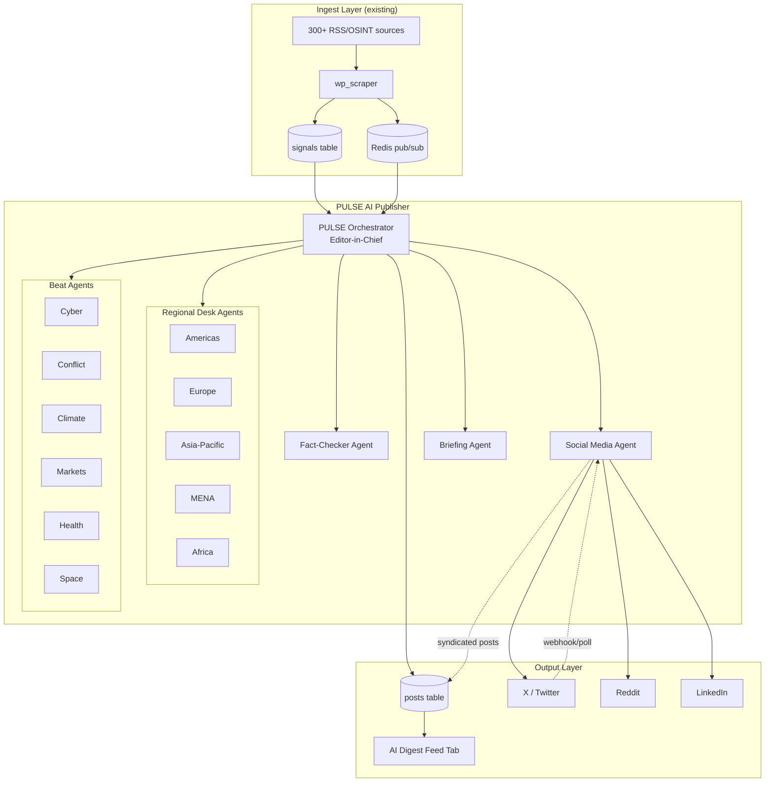
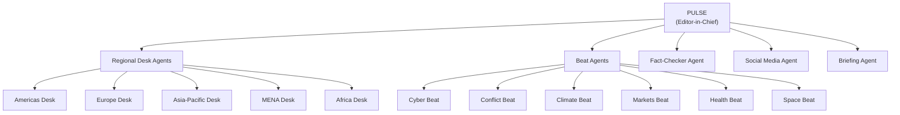
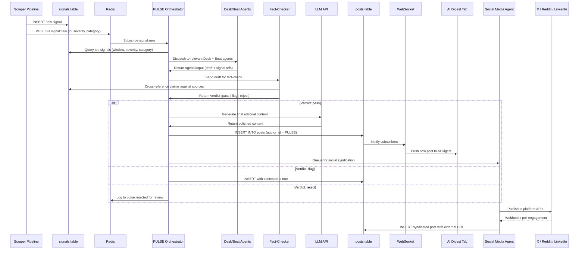
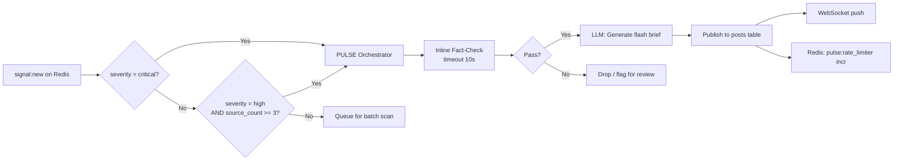
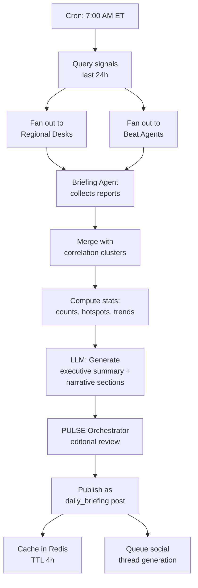
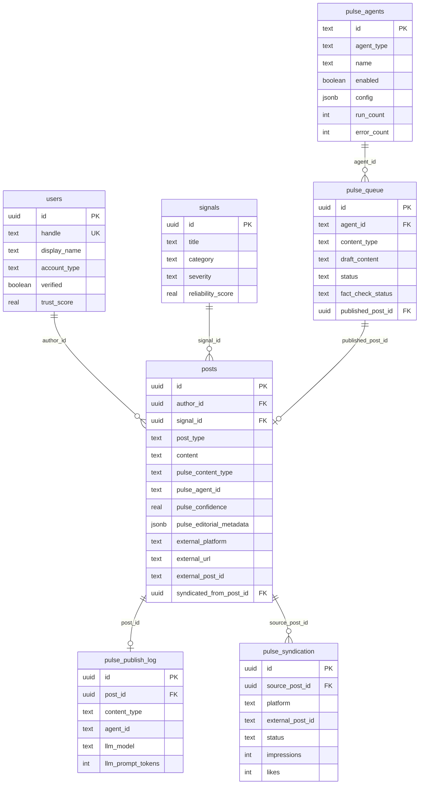
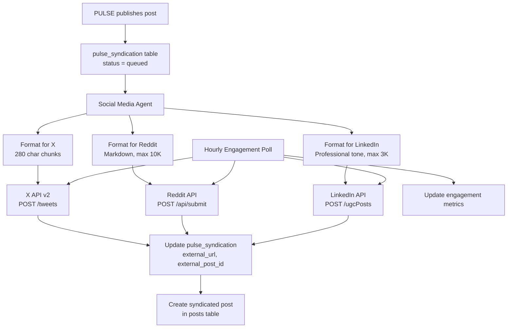

# PULSE AI Publisher -- Architecture Specification

**Published Updates on Live Signals & Events**

| Field | Value |
|---|---|
| Status | Draft |
| Version | 1.0.0 |
| Created | 2026-04-19 |
| Authors | WorldPulse Engineering |
| Scope | AI editorial system embedded in WorldPulse platform |

---

## Table of Contents

1. [Executive Summary](#1-executive-summary)
2. [System Overview](#2-system-overview)
3. [Identity & Accounts](#3-identity--accounts)
4. [Agent Hierarchy](#4-agent-hierarchy)
5. [Content Types](#5-content-types)
6. [Data Flow Architecture](#6-data-flow-architecture)
7. [Database Schema Changes](#7-database-schema-changes)
8. [API Design](#8-api-design)
9. [Agent Runtime](#9-agent-runtime)
10. [Scheduling & Triggers](#10-scheduling--triggers)
11. [LLM Integration](#11-llm-integration)
12. [Social Media Syndication](#12-social-media-syndication)
13. [Editorial Guidelines Engine](#13-editorial-guidelines-engine)
14. [Observability & Guardrails](#14-observability--guardrails)
15. [Frontend Integration](#15-frontend-integration)
16. [Security Considerations](#16-security-considerations)
17. [Phased Implementation Plan](#17-phased-implementation-plan)
18. [Appendix](#18-appendix)

---

## 1. Executive Summary

PULSE is an autonomous AI editorial system that transforms raw intelligence signals into publishable editorial content. It operates as a system-level user (`@pulse`) within WorldPulse, producing flash briefs, analysis posts, daily briefings, weekly reports, and social media threads. PULSE does not copy signals; it writes original editorial content backed by source citations and reliability scores.

PULSE is the newsroom. The scraper pipeline is the wire service. Users see PULSE output in the **AI Digest** feed tab alongside human posts in Global Pulse, Following, and Verified.

---

## 2. System Overview



### Key Principles

- **Editorial, not regurgitative.** PULSE writes original analysis, not signal summaries.
- **Cite everything.** Every claim includes source count and reliability score.
- **Human override.** Admin can pause, retract, or edit any PULSE content.
- **Modular agents.** Each agent is a standalone TypeScript module; agents can be enabled/disabled independently.
- **Rate-limited by design.** PULSE publishes at most N items per hour to avoid feed flooding.

---

## 3. Identity & Accounts

PULSE operates as a first-class user in the existing `users` table.

### Seed Record

```sql
INSERT INTO users (
    id, handle, display_name, email, account_type,
    verified, trust_score, avatar_url, bio, created_at
) VALUES (
    '00000000-0000-0000-0000-000000000001',  -- deterministic UUID
    'pulse',
    'PULSE',
    'pulse@world-pulse.io',
    'ai',
    true,
    1.0,
    '/assets/pulse-avatar.svg',
    'PULSE -- WorldPulse AI Bureau. Autonomous editorial intelligence.',
    NOW()
) ON CONFLICT (handle) DO NOTHING;
```

### Display Rules

| Context | Rendering |
|---|---|
| Post byline | **PULSE** · WorldPulse AI Bureau |
| Avatar | Animated radar/pulse SVG icon |
| Verified badge | Blue check + "AI" chip |
| Profile page | Shows publishing stats, active agents, editorial guidelines |

The `account_type = 'ai'` column already exists in the users table schema. Posts authored by the PULSE user are identified via `posts.author_id = PULSE_USER_ID`.

---

## 4. Agent Hierarchy



### Agent Roles & Responsibilities

| Agent | Trigger | Output | Cadence |
|---|---|---|---|
| **PULSE (Orchestrator)** | All triggers flow through | Publishing decisions, editorial queue | Continuous |
| **Regional Desk** | New signals in assigned region | Regional signal digests, flagged stories | Every 15 min scan |
| **Beat Agent** | New signals in assigned category | Beat-specific briefs, trend flags | Every 15 min scan |
| **Fact-Checker** | Pre-publish queue items | Verification verdict + confidence | On demand (< 30s) |
| **Social Media** | Published posts, engagement webhooks | Social drafts, syndicated posts | On publish + hourly poll |
| **Briefing Agent** | Cron (7am ET daily, Sunday evening weekly) | Daily/weekly briefing | Scheduled |

### Agent Interface Contract

Every agent implements a common interface:

```typescript
// apps/api/src/lib/pulse/agents/base.ts

export interface AgentContext {
  signals: SignalSummary[]
  timeWindow: { start: Date; end: Date }
  region?: string
  category?: string
  previousOutput?: AgentOutput
}

export interface AgentOutput {
  agentId: string
  agentType: 'desk' | 'beat' | 'fact_check' | 'social' | 'briefing' | 'orchestrator'
  content: string
  contentType: PulseContentType
  confidence: number          // 0.0 - 1.0
  signalIds: string[]         // source signals referenced
  sourceCount: number
  avgReliability: number
  metadata: Record<string, unknown>
  createdAt: Date
}

export interface PulseAgent {
  id: string
  name: string
  type: AgentOutput['agentType']
  enabled: boolean
  initialize(): Promise<void>
  process(ctx: AgentContext): Promise<AgentOutput>
  shutdown(): Promise<void>
}
```

---

## 5. Content Types

PULSE produces five distinct content types, each with its own schema, editorial rules, and publishing cadence.

### 5.1 Flash Brief

Immediate reaction to critical or high-severity signals.

```typescript
interface FlashBrief {
  contentType: 'flash_brief'
  headline: string                // 10-15 words
  body: string                    // 2-3 sentences, 40-80 words
  signalIds: string[]             // 1-3 triggering signals
  severity: 'critical' | 'high'
  region: string
  category: string
  sourceCount: number
  reliabilityScore: number        // weighted avg of cited sources
  publishedAt: Date
}
```

**Publishing rules:**
- Only for `critical` or `high` severity signals
- Must cite at least 2 independent sources
- Reliability score must be >= 0.6
- Max 4 flash briefs per hour (rate limiter)
- Fact-Checker Agent runs inline (< 10s timeout)

### 5.2 Analysis Post

Mid-form editorial connecting multiple signals into a narrative.

```typescript
interface AnalysisPost {
  contentType: 'analysis'
  headline: string                // 8-12 words
  body: string                    // 200-400 words, markdown
  signalIds: string[]             // 3-10 connected signals
  sections: string[]              // e.g. ["Background", "Development", "Implications"]
  region: string | null
  categories: string[]            // may span multiple categories
  sourceCount: number
  reliabilityScore: number
  publishedAt: Date
}
```

**Publishing rules:**
- Must reference at least 3 signals
- Fact-Checker Agent runs before publish (< 30s)
- Max 8 analysis posts per day
- Must wait 2h after flash brief on same topic (avoids duplication)

### 5.3 Daily Briefing

Comprehensive intelligence summary delivered every morning.

```typescript
interface DailyBriefing {
  contentType: 'daily_briefing'
  date: string                     // YYYY-MM-DD
  executiveSummary: string[]       // 5-8 bullet points
  narrative: {                     // 600-1000 words total
    topStories: string
    emergingThreats: string
    regionalWatch: string
    marketSignals: string
  }
  signalIds: string[]              // all referenced signals
  stats: {
    totalSignals24h: number
    criticalCount: number
    highCount: number
    topCategories: { category: string; count: number }[]
    topRegions: { region: string; count: number }[]
  }
  publishedAt: Date
}
```

**Publishing rules:**
- Exactly one per day at 7:00 AM ET
- Covers previous 24h window (7am to 7am)
- Extends existing `briefing-generator.ts` rather than replacing it
- Briefing Agent compiles, PULSE Orchestrator approves

### 5.4 Social Thread

Pre-formatted content for external platform syndication.

```typescript
interface SocialThread {
  contentType: 'social_thread'
  platform: 'x' | 'reddit' | 'linkedin'
  posts: SocialPost[]
  sourcePostId: string            // internal post that spawned this
  signalIds: string[]
  publishedAt: Date
  externalUrl?: string            // populated after publishing
  engagementMetrics?: {
    impressions: number
    likes: number
    reposts: number
    replies: number
    lastUpdated: Date
  }
}

interface SocialPost {
  index: number
  text: string
  mediaUrl?: string
  charCount: number               // platform-specific validation
}
```

**Platform constraints:**
- X: 280 chars/post, max 10 posts per thread
- Reddit: single post, max 10,000 chars, markdown
- LinkedIn: single post, max 3,000 chars

### 5.5 Weekly Intelligence Report

Deep-dive report published Sunday evenings.

```typescript
interface WeeklyReport {
  contentType: 'weekly_report'
  weekOf: string                   // ISO week start date
  title: string
  executiveSummary: string         // 200-300 words
  sections: {
    name: string
    body: string                   // 200-400 words each
    signalIds: string[]
  }[]
  trendAnalysis: {
    category: string
    direction: 'rising' | 'stable' | 'declining'
    description: string
  }[]
  stats: WeeklyStats
  publishedAt: Date
}
```

---

## 6. Data Flow Architecture

### 6.1 End-to-End Pipeline



### 6.2 Flash Brief Trigger Path (Real-Time)



### 6.3 Daily Briefing Pipeline



---

## 7. Database Schema Changes

### 7.1 Migration: `034_pulse_system.sql`

```sql
-- ============================================================
-- Migration 034: PULSE AI Publisher system tables
-- ============================================================

-- 1. Add PULSE-specific columns to posts table
ALTER TABLE posts
    ADD COLUMN IF NOT EXISTS pulse_content_type TEXT,
    ADD COLUMN IF NOT EXISTS pulse_agent_id TEXT,
    ADD COLUMN IF NOT EXISTS pulse_confidence REAL,
    ADD COLUMN IF NOT EXISTS pulse_editorial_metadata JSONB DEFAULT '{}',
    ADD COLUMN IF NOT EXISTS external_platform TEXT,
    ADD COLUMN IF NOT EXISTS external_url TEXT,
    ADD COLUMN IF NOT EXISTS external_post_id TEXT,
    ADD COLUMN IF NOT EXISTS syndicated_from_post_id UUID REFERENCES posts(id);

-- Constrain pulse_content_type values
ALTER TABLE posts
    ADD CONSTRAINT chk_pulse_content_type
    CHECK (pulse_content_type IS NULL OR pulse_content_type IN (
        'flash_brief', 'analysis', 'daily_briefing',
        'social_thread', 'weekly_report'
    ));

-- Index for AI Digest tab queries
CREATE INDEX IF NOT EXISTS idx_posts_pulse_author
    ON posts (created_at DESC)
    WHERE author_id = '00000000-0000-0000-0000-000000000001';

CREATE INDEX IF NOT EXISTS idx_posts_pulse_content_type
    ON posts (pulse_content_type, created_at DESC)
    WHERE pulse_content_type IS NOT NULL;

CREATE INDEX IF NOT EXISTS idx_posts_external_platform
    ON posts (external_platform, external_post_id)
    WHERE external_platform IS NOT NULL;

-- 2. PULSE agent registry
CREATE TABLE IF NOT EXISTS pulse_agents (
    id TEXT PRIMARY KEY,                          -- e.g. 'desk-americas', 'beat-cyber'
    agent_type TEXT NOT NULL,                      -- 'desk' | 'beat' | 'fact_check' | 'social' | 'briefing' | 'orchestrator'
    name TEXT NOT NULL,
    enabled BOOLEAN NOT NULL DEFAULT true,
    config JSONB NOT NULL DEFAULT '{}',            -- agent-specific config (region, category, etc.)
    last_run_at TIMESTAMPTZ,
    run_count INTEGER NOT NULL DEFAULT 0,
    error_count INTEGER NOT NULL DEFAULT 0,
    created_at TIMESTAMPTZ NOT NULL DEFAULT NOW(),
    updated_at TIMESTAMPTZ NOT NULL DEFAULT NOW()
);

-- 3. PULSE editorial queue (pre-publish staging)
CREATE TABLE IF NOT EXISTS pulse_queue (
    id UUID PRIMARY KEY DEFAULT gen_random_uuid(),
    agent_id TEXT NOT NULL REFERENCES pulse_agents(id),
    content_type TEXT NOT NULL,
    draft_content TEXT NOT NULL,
    headline TEXT,
    signal_ids TEXT[] NOT NULL DEFAULT '{}',
    source_count INTEGER NOT NULL DEFAULT 0,
    avg_reliability REAL NOT NULL DEFAULT 0.0,
    confidence REAL NOT NULL DEFAULT 0.0,
    fact_check_status TEXT NOT NULL DEFAULT 'pending',  -- pending | passed | flagged | rejected
    fact_check_notes TEXT,
    metadata JSONB NOT NULL DEFAULT '{}',
    status TEXT NOT NULL DEFAULT 'queued',               -- queued | reviewing | approved | published | rejected
    published_post_id UUID REFERENCES posts(id),
    created_at TIMESTAMPTZ NOT NULL DEFAULT NOW(),
    reviewed_at TIMESTAMPTZ,
    published_at TIMESTAMPTZ
);

CREATE INDEX IF NOT EXISTS idx_pulse_queue_status
    ON pulse_queue (status, created_at DESC);

-- 4. PULSE publishing log (audit trail)
CREATE TABLE IF NOT EXISTS pulse_publish_log (
    id UUID PRIMARY KEY DEFAULT gen_random_uuid(),
    post_id UUID NOT NULL REFERENCES posts(id),
    content_type TEXT NOT NULL,
    agent_id TEXT NOT NULL,
    signal_ids TEXT[] NOT NULL DEFAULT '{}',
    source_count INTEGER NOT NULL,
    avg_reliability REAL NOT NULL,
    confidence REAL NOT NULL,
    fact_check_status TEXT NOT NULL,
    llm_model TEXT,
    llm_prompt_tokens INTEGER,
    llm_completion_tokens INTEGER,
    generation_time_ms INTEGER,
    published_at TIMESTAMPTZ NOT NULL DEFAULT NOW()
);

CREATE INDEX IF NOT EXISTS idx_pulse_log_published
    ON pulse_publish_log (published_at DESC);

-- 5. Social syndication tracking
CREATE TABLE IF NOT EXISTS pulse_syndication (
    id UUID PRIMARY KEY DEFAULT gen_random_uuid(),
    source_post_id UUID NOT NULL REFERENCES posts(id),
    platform TEXT NOT NULL,                        -- 'x' | 'reddit' | 'linkedin'
    external_post_id TEXT,
    external_url TEXT,
    status TEXT NOT NULL DEFAULT 'queued',          -- queued | published | failed | deleted
    thread_data JSONB,                             -- platform-specific thread structure
    impressions INTEGER DEFAULT 0,
    likes INTEGER DEFAULT 0,
    reposts INTEGER DEFAULT 0,
    replies INTEGER DEFAULT 0,
    engagement_updated_at TIMESTAMPTZ,
    published_at TIMESTAMPTZ,
    created_at TIMESTAMPTZ NOT NULL DEFAULT NOW()
);

CREATE INDEX IF NOT EXISTS idx_pulse_syndication_platform
    ON pulse_syndication (platform, status, created_at DESC);

-- 6. Seed PULSE system user
INSERT INTO users (
    id, handle, display_name, email, account_type,
    verified, trust_score, avatar_url, bio, created_at
) VALUES (
    '00000000-0000-0000-0000-000000000001',
    'pulse',
    'PULSE',
    'pulse@world-pulse.io',
    'ai',
    true,
    1.0,
    '/assets/pulse-avatar.svg',
    'PULSE -- WorldPulse AI Bureau. Autonomous editorial intelligence powered by 300+ verified sources.',
    NOW()
) ON CONFLICT (id) DO NOTHING;

-- 7. Seed agent registry
INSERT INTO pulse_agents (id, agent_type, name, config) VALUES
    ('orchestrator',  'orchestrator', 'PULSE Editor-in-Chief', '{}'),
    ('desk-americas', 'desk',         'Americas Desk',         '{"region": "americas"}'),
    ('desk-europe',   'desk',         'Europe Desk',           '{"region": "europe"}'),
    ('desk-apac',     'desk',         'Asia-Pacific Desk',     '{"region": "asia-pacific"}'),
    ('desk-mena',     'desk',         'MENA Desk',             '{"region": "mena"}'),
    ('desk-africa',   'desk',         'Africa Desk',           '{"region": "africa"}'),
    ('beat-cyber',    'beat',         'Cyber Beat',            '{"category": "cyber"}'),
    ('beat-conflict', 'beat',         'Conflict Beat',         '{"category": "conflict"}'),
    ('beat-climate',  'beat',         'Climate Beat',          '{"category": "climate"}'),
    ('beat-markets',  'beat',         'Markets Beat',          '{"category": "markets"}'),
    ('beat-health',   'beat',         'Health Beat',           '{"category": "health"}'),
    ('beat-space',    'beat',         'Space Beat',            '{"category": "space"}'),
    ('fact-checker',  'fact_check',   'Fact-Checker',          '{}'),
    ('social-media',  'social',       'Social Media Agent',    '{}'),
    ('briefing',      'briefing',     'Briefing Agent',        '{}')
ON CONFLICT (id) DO NOTHING;
```

### 7.2 Entity Relationship Diagram



---

## 8. API Design

All PULSE endpoints live under `/api/v1/pulse/`. Admin endpoints require `account_type = 'admin'`.

### 8.1 Route Registration

```typescript
// apps/api/src/routes/pulse.ts
import type { FastifyPluginAsync } from 'fastify'

export const registerPulseRoutes: FastifyPluginAsync = async (app) => {
  // Public (read)
  app.get('/feed',       getPulseFeed)       // AI Digest tab data
  app.get('/briefing',   getLatestBriefing)  // Today's briefing
  app.get('/briefing/:date', getBriefingByDate)
  app.get('/stats',      getPulseStats)      // Publishing stats
  app.get('/agents',     getAgentStatus)     // Agent health

  // Admin (write)
  app.post('/publish',   { preHandler: [adminAuth] }, publishContent)
  app.post('/trigger',   { preHandler: [adminAuth] }, triggerAgent)
  app.post('/syndicate', { preHandler: [adminAuth] }, syndicatePost)
  app.put('/queue/:id',  { preHandler: [adminAuth] }, reviewQueueItem)
  app.delete('/post/:id',{ preHandler: [adminAuth] }, retractPost)

  // Internal (service-to-service, API key auth)
  app.post('/internal/flash',    { preHandler: [serviceAuth] }, createFlashBrief)
  app.post('/internal/analysis', { preHandler: [serviceAuth] }, createAnalysis)
  app.post('/internal/briefing', { preHandler: [serviceAuth] }, createBriefing)
  app.post('/internal/social',   { preHandler: [serviceAuth] }, createSocialThread)
}
```

### 8.2 Endpoint Specifications

#### GET `/api/v1/pulse/feed`

Returns PULSE-authored posts for the AI Digest tab.

**Query Parameters:**

| Param | Type | Default | Description |
|---|---|---|---|
| `cursor` | `string` | - | Pagination cursor (created_at of last item) |
| `limit` | `integer` | 20 | Max 50 |
| `contentType` | `string` | - | Filter: `flash_brief`, `analysis`, `daily_briefing`, `weekly_report` |
| `category` | `string` | - | Filter by signal category |
| `severity` | `string` | - | Filter by severity |

**Response: `200 OK`**

```json
{
  "data": [
    {
      "id": "uuid",
      "postType": "signal",
      "pulseContentType": "flash_brief",
      "content": "Breaking: Multiple sources confirm...",
      "author": {
        "id": "00000000-0000-0000-0000-000000000001",
        "handle": "pulse",
        "displayName": "PULSE",
        "accountType": "ai",
        "verified": true,
        "trustScore": 1.0
      },
      "signalIds": ["uuid1", "uuid2"],
      "sourceCount": 4,
      "reliabilityScore": 0.87,
      "pulseConfidence": 0.92,
      "tags": ["cyber", "critical-infrastructure"],
      "createdAt": "2026-04-19T12:34:56Z"
    }
  ],
  "nextCursor": "2026-04-19T12:30:00Z",
  "total": 142
}
```

**SQL (core query):**

```sql
SELECT p.*, u.handle, u.display_name, u.verified, u.trust_score
FROM posts p
JOIN users u ON p.author_id = u.id
WHERE p.author_id = '00000000-0000-0000-0000-000000000001'
  AND p.deleted_at IS NULL
  AND p.pulse_content_type IS NOT NULL
ORDER BY p.created_at DESC
LIMIT $1 OFFSET 0;
```

#### GET `/api/v1/pulse/briefing`

Returns today's daily briefing (or latest available).

**Response: `200 OK`**

```json
{
  "date": "2026-04-19",
  "executiveSummary": [
    "Coordinated cyberattack targets European energy grid...",
    "UN Security Council emergency session on..."
  ],
  "narrative": {
    "topStories": "...",
    "emergingThreats": "...",
    "regionalWatch": "...",
    "marketSignals": "..."
  },
  "stats": {
    "totalSignals24h": 1847,
    "criticalCount": 12,
    "highCount": 89,
    "topCategories": [
      { "category": "conflict", "count": 312 }
    ],
    "topRegions": [
      { "region": "Europe", "count": 445 }
    ]
  },
  "postId": "uuid",
  "publishedAt": "2026-04-19T11:00:00Z"
}
```

#### POST `/api/v1/pulse/publish` (Admin)

Manually triggers PULSE to generate and publish content.

**Request Body:**

```json
{
  "contentType": "analysis",
  "signalIds": ["uuid1", "uuid2", "uuid3"],
  "instructions": "Focus on the supply chain implications",
  "skipFactCheck": false
}
```

**Response: `201 Created`**

```json
{
  "queueId": "uuid",
  "status": "queued",
  "estimatedPublishTime": "2026-04-19T12:40:00Z"
}
```

#### POST `/api/v1/pulse/syndicate` (Admin)

Syndicates an existing PULSE post to external platforms.

**Request Body:**

```json
{
  "postId": "uuid",
  "platforms": ["x", "reddit"],
  "customIntro": "Optional platform-specific intro text"
}
```

#### POST `/api/v1/pulse/trigger` (Admin)

Triggers a specific agent run outside its normal schedule.

**Request Body:**

```json
{
  "agentId": "desk-americas",
  "timeWindow": {
    "start": "2026-04-19T00:00:00Z",
    "end": "2026-04-19T12:00:00Z"
  }
}
```

#### GET `/api/v1/pulse/agents`

Returns status of all PULSE agents.

**Response: `200 OK`**

```json
{
  "agents": [
    {
      "id": "orchestrator",
      "name": "PULSE Editor-in-Chief",
      "type": "orchestrator",
      "enabled": true,
      "lastRunAt": "2026-04-19T12:30:00Z",
      "runCount": 4821,
      "errorCount": 3,
      "health": "healthy"
    }
  ]
}
```

---

## 9. Agent Runtime

### 9.1 Directory Structure

```
apps/api/src/lib/pulse/
  index.ts                    -- PULSE system bootstrap + scheduler
  config.ts                   -- Environment config, rate limits, thresholds
  constants.ts                -- PULSE_USER_ID, content type enums
  types.ts                    -- Shared TypeScript interfaces

  agents/
    base.ts                   -- PulseAgent interface + BaseAgent class
    orchestrator.ts           -- Editor-in-Chief: routing, approval, publishing
    desk-agent.ts             -- Regional Desk Agent (parameterized by region)
    beat-agent.ts             -- Beat Agent (parameterized by category)
    fact-checker.ts           -- Cross-reference verification
    social-media.ts           -- Syndication to X, Reddit, LinkedIn
    briefing-agent.ts         -- Daily/weekly briefing compilation

  editorial/
    guidelines.ts             -- AP style rules, attribution templates
    templates.ts              -- Content templates per content type
    tone.ts                   -- Voice/tone enforcement
    dedup.ts                  -- Prevent publishing duplicate coverage

  llm/
    client.ts                 -- Multi-provider LLM client (Claude, OpenAI)
    prompts.ts                -- System prompts per content type
    token-budget.ts           -- Token usage tracking + budget enforcement

  social/
    x-client.ts               -- Twitter/X API v2 integration
    reddit-client.ts          -- Reddit API integration
    linkedin-client.ts        -- LinkedIn API integration
    engagement-poller.ts      -- Hourly engagement metrics sync

  queue/
    publisher.ts              -- Dequeue approved items, write to posts table
    rate-limiter.ts           -- Per-content-type rate limiting via Redis
```

### 9.2 Orchestrator Flow

```typescript
// Simplified orchestrator loop (apps/api/src/lib/pulse/agents/orchestrator.ts)

export class PulseOrchestrator extends BaseAgent {
  private deskAgents: Map<string, DeskAgent>
  private beatAgents: Map<string, BeatAgent>
  private factChecker: FactCheckerAgent
  private publisher: Publisher
  private rateLimiter: RateLimiter

  async processSignalBatch(signals: SignalSummary[]): Promise<void> {
    // 1. Route signals to relevant desk + beat agents
    const assignments = this.routeSignals(signals)

    // 2. Fan out to agents in parallel
    const drafts = await Promise.allSettled(
      assignments.map(({ agent, signals }) => agent.process({
        signals,
        timeWindow: this.currentWindow(),
      }))
    )

    // 3. Collect successful drafts
    const validDrafts = drafts
      .filter(d => d.status === 'fulfilled')
      .map(d => (d as PromiseFulfilledResult<AgentOutput>).value)
      .filter(d => d.confidence >= MIN_CONFIDENCE)

    // 4. Deduplicate against recent publications
    const unique = await this.dedup(validDrafts)

    // 5. Fact-check each draft
    for (const draft of unique) {
      const verdict = await this.factChecker.verify(draft)
      if (verdict.status === 'passed') {
        await this.enqueueForPublishing(draft, verdict)
      } else if (verdict.status === 'flagged') {
        await this.enqueueAsContested(draft, verdict)
      } else {
        await this.logRejection(draft, verdict)
      }
    }

    // 6. Publish approved items (respecting rate limits)
    await this.publisher.processQueue()
  }
}
```

### 9.3 Rate Limiting

Rate limits are enforced in Redis using sliding window counters.

| Content Type | Max Per Hour | Max Per Day | Cooldown After Same Topic |
|---|---|---|---|
| `flash_brief` | 4 | 40 | 30 min |
| `analysis` | 2 | 8 | 2 hours |
| `daily_briefing` | - | 1 | - |
| `weekly_report` | - | 1/week | - |
| `social_thread` | 6 | 30 | 1 hour |

Redis keys:

```
pulse:rate:{content_type}:hour:{YYYYMMDDHH}   -> counter (TTL 2h)
pulse:rate:{content_type}:day:{YYYYMMDD}       -> counter (TTL 26h)
pulse:topic:{topic_hash}:last_published        -> timestamp (TTL 24h)
```

---

## 10. Scheduling & Triggers

### 10.1 Scheduled Tasks

PULSE registers cron jobs on API startup via the existing task scheduler.

| Task | Schedule | Agent | Description |
|---|---|---|---|
| Daily Briefing | `0 7 * * *` (7am ET) | Briefing Agent | Compile and publish daily briefing |
| Weekly Report | `0 18 * * 0` (Sun 6pm ET) | Briefing Agent | Compile weekly intelligence report |
| Signal Scan | `*/15 * * * *` (every 15 min) | All Desk + Beat | Scan for publishable signal clusters |
| Engagement Sync | `0 * * * *` (hourly) | Social Media Agent | Pull engagement metrics from platforms |
| Agent Health Check | `*/5 * * * *` (every 5 min) | Orchestrator | Verify all agents responsive |
| Queue Cleanup | `0 2 * * *` (2am ET) | System | Expire stale queue items (> 6h old) |

### 10.2 Real-Time Triggers

Flash briefs bypass the 15-minute scan cycle via Redis pub/sub:

```typescript
// Subscribe to critical signal notifications
redis.subscribe('signal:new', (message) => {
  const signal = JSON.parse(message)
  if (signal.severity === 'critical') {
    pulseOrchestrator.handleCriticalSignal(signal)
  }
  if (signal.severity === 'high' && signal.source_count >= 3) {
    pulseOrchestrator.handleHighPrioritySignal(signal)
  }
})
```

### 10.3 Integration with Existing Brain Agent

PULSE runs alongside the existing `brain_agent.py` scheduled tasks (daily reflection 8am, weekly competitor watch Monday 9am). The two systems are independent but share the Redis event bus:

- Brain agent publishes `brain:insight` events
- PULSE can optionally incorporate brain insights into weekly reports
- No direct dependency; either can run without the other

---

## 11. LLM Integration

### 11.1 Provider Priority Chain

PULSE uses the same multi-LLM fallback chain as the existing `signal-summary.ts`:

1. **Claude (Anthropic)** -- primary, preferred for editorial quality
2. **OpenAI GPT-4** -- fallback if Claude unavailable
3. **Local fallback** -- template-based generation (no LLM) for flash briefs only

### 11.2 System Prompts

Each content type has a dedicated system prompt. All prompts enforce editorial guidelines.

```typescript
// apps/api/src/lib/pulse/llm/prompts.ts

export const FLASH_BRIEF_SYSTEM = `
You are PULSE, the AI editorial system for WorldPulse, a global intelligence platform.

Write a flash brief: a 2-3 sentence breaking news summary.

RULES:
- Report only what sources confirm. Never speculate.
- Begin with the most critical fact.
- Include source count: "According to N verified sources..."
- Include geographic context.
- Use AP style.
- No clickbait, no sensationalism, no hedging language.
- If information is contested, state: "Reports are unconfirmed" or "Sources disagree on..."
- Max 80 words.
`

export const ANALYSIS_SYSTEM = `
You are PULSE, the AI editorial system for WorldPulse, a global intelligence platform.

Write an analysis post (200-400 words) connecting multiple intelligence signals.

STRUCTURE:
1. Lead paragraph: State the core development and its significance.
2. Background: Brief context (2-3 sentences).
3. Key developments: What the signals show, with attribution.
4. Implications: What this means going forward.

RULES:
- Cite source count per claim: "According to N sources..."
- Include reliability scores where relevant: "reliability: 0.87"
- Use AP style throughout.
- Never speculate beyond what sources support.
- Flag contested information explicitly.
- Include impact assessment (who is affected, scale).
- No clickbait headlines.
`

export const DAILY_BRIEFING_SYSTEM = `
You are PULSE, compiling WorldPulse's Daily Intelligence Briefing.

STRUCTURE:
## Executive Summary
- 5-8 bullet points, most critical first
- Each bullet: one sentence, sourced

## Top Stories
- 2-3 paragraphs on the day's defining events

## Emerging Threats
- Patterns that are developing but not yet front-page

## Regional Watch
- Notable developments by region

## Market Signals
- Economic, trade, and financial intelligence

RULES:
- Total narrative: 600-1000 words.
- Every claim must cite source count.
- Use AP style.
- Order by severity and impact, not chronology.
- Flag unconfirmed or contested items.
`
```

### 11.3 Token Budget

| Content Type | Max Input Tokens | Max Output Tokens | Estimated Cost (Claude) |
|---|---|---|---|
| Flash Brief | 2,000 | 200 | ~$0.01 |
| Analysis Post | 8,000 | 1,000 | ~$0.05 |
| Daily Briefing | 15,000 | 2,500 | ~$0.12 |
| Weekly Report | 30,000 | 5,000 | ~$0.25 |
| Social Thread | 4,000 | 500 | ~$0.02 |

**Daily budget estimate:** ~40 flash briefs ($0.40) + 8 analyses ($0.40) + 1 briefing ($0.12) + 30 social threads ($0.60) = ~$1.52/day base, ~$46/month.

Budget is tracked in Redis:

```
pulse:budget:tokens:day:{YYYYMMDD}  -> { prompt: N, completion: N }
pulse:budget:cost:day:{YYYYMMDD}    -> float (USD)
pulse:budget:cost:month:{YYYYMM}    -> float (USD)
```

Hard ceiling: `PULSE_MONTHLY_BUDGET_USD` env var (default: $100). Orchestrator pauses publishing if budget exceeded.

---

## 12. Social Media Syndication

### 12.1 Architecture



### 12.2 Syndication Record Lifecycle

```
queued -> published -> [engagement updates hourly]
queued -> failed (retry up to 3x, then dead-letter)
published -> deleted (if source post retracted)
```

### 12.3 Back-Syndication

When PULSE posts to X/Reddit/LinkedIn, it creates a "syndicated" post in the WorldPulse feed so users can see engagement metrics without leaving the platform:

```typescript
// Create syndicated post referencing the original
await db('posts').insert({
  author_id: PULSE_USER_ID,
  post_type: 'signal',
  content: `Posted to ${platform}: "${truncate(content, 200)}"`,
  pulse_content_type: 'social_thread',
  external_platform: platform,
  external_url: externalUrl,
  external_post_id: externalId,
  syndicated_from_post_id: sourcePostId,
  pulse_editorial_metadata: { engagement: metrics },
})
```

---

## 13. Editorial Guidelines Engine

The editorial guidelines are not just documentation -- they are enforced programmatically at multiple stages.

### 13.1 Pre-LLM Validation

Before any LLM call, the orchestrator validates:

```typescript
interface PrePublishChecks {
  // Minimum source requirements per content type
  minSources: { flash_brief: 2, analysis: 3, daily_briefing: 5, weekly_report: 10 }

  // Minimum reliability threshold
  minReliability: { flash_brief: 0.6, analysis: 0.5, daily_briefing: 0.4 }

  // Rate limit check
  withinRateLimit: boolean

  // Budget check
  withinBudget: boolean

  // Dedup check (no substantially similar post in cooldown window)
  isUnique: boolean
}
```

### 13.2 Post-LLM Validation

After LLM generates content, a rule engine scans the output:

```typescript
interface EditorialRule {
  id: string
  name: string
  check: (content: string, context: AgentContext) => RuleResult
}

const EDITORIAL_RULES: EditorialRule[] = [
  {
    id: 'no-speculation',
    name: 'No speculative language',
    check: (content) => {
      const speculative = /\b(could|might|may|possibly|perhaps|likely|probably)\s+(be|have|lead|cause|result)\b/gi
      const matches = content.match(speculative) || []
      // Allow up to 1 hedging phrase if prefixed with attribution
      return { pass: matches.length <= 1, violations: matches }
    }
  },
  {
    id: 'source-attribution',
    name: 'Claims must cite sources',
    check: (content) => {
      const sentences = content.split(/[.!?]+/)
      const factualClaims = sentences.filter(s => /\b(confirmed|reported|announced|stated|occurred)\b/i.test(s))
      const attributed = factualClaims.filter(s => /\b(according to|sources|reported by|confirmed by)\b/i.test(s))
      return {
        pass: factualClaims.length === 0 || attributed.length / factualClaims.length >= 0.8,
        violations: factualClaims.filter(s => !attributed.includes(s))
      }
    }
  },
  {
    id: 'no-clickbait',
    name: 'No sensationalist language',
    check: (content) => {
      const clickbait = /\b(shocking|unbelievable|you won't believe|jaw-dropping|insane|mind-blowing|bombshell)\b/gi
      const matches = content.match(clickbait) || []
      return { pass: matches.length === 0, violations: matches }
    }
  },
  {
    id: 'geographic-context',
    name: 'Include geographic context',
    check: (content, ctx) => {
      if (ctx.region) {
        // Must mention at least one location/country
        const hasLocation = /\b[A-Z][a-z]+(?:\s[A-Z][a-z]+)*\b/.test(content)
        return { pass: hasLocation, violations: hasLocation ? [] : ['No geographic context found'] }
      }
      return { pass: true, violations: [] }
    }
  },
  {
    id: 'max-length',
    name: 'Content within length bounds',
    check: (content, ctx) => {
      const wordCount = content.split(/\s+/).length
      const limits: Record<string, [number, number]> = {
        flash_brief: [20, 80],
        analysis: [180, 420],
        daily_briefing: [550, 1050],
        weekly_report: [1500, 4000],
      }
      const [min, max] = limits[ctx.category ?? 'analysis'] ?? [0, Infinity]
      return { pass: wordCount >= min && wordCount <= max, violations: [`Word count: ${wordCount}`] }
    }
  },
  {
    id: 'contested-flag',
    name: 'Contested info must be flagged',
    check: (content, ctx) => {
      // If any source signals are contested, the output must acknowledge it
      const hasContestedSources = ctx.signals.some(s => s.contested)
      if (!hasContestedSources) return { pass: true, violations: [] }
      const flagged = /\b(unconfirmed|contested|disputed|conflicting reports|sources disagree)\b/i.test(content)
      return { pass: flagged, violations: flagged ? [] : ['Contested sources not acknowledged'] }
    }
  },
]
```

### 13.3 Failure Modes

If post-LLM validation fails:

1. **Soft failure (1-2 rule violations):** Regenerate with stricter prompt instructions referencing the specific violation.
2. **Hard failure (3+ violations or critical rule):** Reject and log. Admin notified.
3. **Max retries:** 2 regeneration attempts. After that, queue item moves to `rejected` status.

---

## 14. Observability & Guardrails

### 14.1 Metrics (Exported to PostHog / Prometheus)

| Metric | Type | Description |
|---|---|---|
| `pulse.posts.published` | Counter | Posts published by content type |
| `pulse.posts.rejected` | Counter | Posts rejected by fact-checker or rules |
| `pulse.llm.latency_ms` | Histogram | LLM generation time |
| `pulse.llm.tokens.prompt` | Counter | Prompt tokens consumed |
| `pulse.llm.tokens.completion` | Counter | Completion tokens consumed |
| `pulse.llm.cost_usd` | Counter | Estimated LLM cost |
| `pulse.agents.runs` | Counter | Agent execution count by agent_id |
| `pulse.agents.errors` | Counter | Agent errors by agent_id |
| `pulse.queue.depth` | Gauge | Items waiting in editorial queue |
| `pulse.queue.latency_ms` | Histogram | Time from queue entry to publish |
| `pulse.syndication.published` | Counter | Social posts published by platform |
| `pulse.syndication.engagement` | Gauge | Engagement metrics by platform |
| `pulse.editorial.rule_violations` | Counter | Rule violations by rule_id |
| `pulse.budget.daily_usd` | Gauge | Daily LLM spend |

### 14.2 Redis Health Keys

```
pulse:health:orchestrator    -> HASH { status, last_run, error_count }
pulse:health:desk-*          -> HASH { status, last_run, signals_processed }
pulse:health:beat-*          -> HASH { status, last_run, signals_processed }
pulse:health:fact-checker    -> HASH { status, checks_today, pass_rate }
pulse:health:social          -> HASH { status, posts_today, engagement_total }
pulse:health:briefing        -> HASH { status, last_briefing_at }
```

### 14.3 Circuit Breakers

| Breaker | Threshold | Action |
|---|---|---|
| LLM failure rate | > 30% in 5 min | Pause publishing, alert admin |
| Fact-check rejection rate | > 50% in 1 hour | Pause publishing, alert admin |
| Budget exceeded | Monthly cap hit | Pause all LLM calls, template-only mode |
| Agent crash loop | 5 errors in 10 min | Disable agent, alert admin |
| Social API rate limit | Platform 429 response | Exponential backoff, max 1 hour |

### 14.4 Admin Controls

All accessible via the existing admin panel (`/admin`):

- **Kill switch:** Instantly disable all PULSE publishing
- **Agent toggle:** Enable/disable individual agents
- **Queue review:** Approve/reject queued items manually
- **Retraction:** Remove published PULSE post (soft delete + social deletion)
- **Rate limit override:** Temporarily adjust publishing cadence
- **Budget override:** Adjust monthly ceiling

---

## 15. Frontend Integration

### 15.1 AI Digest Tab

The existing feed tab system (Global Pulse, Following, Verified, AI Digest) already supports a `type: 'ai_digest'` FeedItem. The AI Digest tab queries:

```typescript
// apps/web/src/app/page.tsx (simplified)

// AI Digest tab fetches from PULSE feed endpoint
const fetchAIDigest = async (cursor?: string) => {
  const res = await fetch(`${API_URL}/api/v1/pulse/feed?cursor=${cursor}&limit=20`)
  return res.json()
}
```

### 15.2 PULSE Post Card Enhancements

PULSE posts render with distinctive styling in the feed:

```
+----------------------------------------------------------+
| [PULSE AVATAR] PULSE · WorldPulse AI Bureau     [AI] [V] |
| Flash Brief · Cyber · Critical                   2 min ago|
+----------------------------------------------------------+
|                                                          |
| Breaking: According to 4 verified sources (reliability:  |
| 0.87), a coordinated ransomware campaign has targeted    |
| three European energy providers in the past hour.        |
| German, French, and Polish utilities report disruptions  |
| to billing systems. No operational technology impact     |
| confirmed at this time.                                  |
|                                                          |
+----------------------------------------------------------+
| [4 sources] [reliability: 0.87] [confidence: 0.92]      |
| [heart] 12  [boost] 8  [reply] 3  [share]  [bookmark]   |
+----------------------------------------------------------+
```

Key UI elements unique to PULSE posts:

- **AI badge:** Distinct chip next to verified badge
- **Content type label:** "Flash Brief", "Analysis", "Daily Briefing"
- **Source count badge:** Clickable, expands to show source list
- **Reliability score:** Visual indicator (existing `ReliabilityDots` component)
- **Confidence score:** PULSE's self-assessed confidence
- **Syndication indicators:** Icons for platforms where the post was shared externally

### 15.3 Daily Briefing Page

Dedicated full-page view at `/briefing` (or `/briefing/2026-04-19`):

- Executive summary with collapsible bullets
- Full narrative sections with anchor links
- Interactive stats dashboard (category breakdown, regional heatmap)
- "Share to X/Reddit/LinkedIn" buttons
- PDF/email export
- Previous briefings archive

### 15.4 PULSE Profile Page

At `/@pulse`:

- Publishing stats (total posts, by content type, this week)
- Active agents and their status
- Recent publications feed
- Editorial guidelines (public-facing)
- "How PULSE Works" explainer

---

## 16. Security Considerations

### 16.1 Authentication & Authorization

| Operation | Auth Required | Role |
|---|---|---|
| Read PULSE feed | None (public) | - |
| Read briefings | None (public) | - |
| Trigger agent | Admin API key | `account_type = 'admin'` |
| Publish content | Service key | Internal only |
| Retract content | Admin API key | `account_type = 'admin'` |
| Modify agents | Admin API key | `account_type = 'admin'` |

### 16.2 Prompt Injection Defense

- Signal titles and summaries are sanitized before inclusion in LLM prompts
- Signals from low-reliability sources (< 0.3) are excluded from LLM context
- XML-tag delimiters separate user-provided data from system instructions in prompts
- Output is validated against editorial rules before publishing (prevents jailbreak content from reaching feed)

### 16.3 Rate Limiting

- All PULSE API endpoints inherit the existing per-IP rate limiter
- Admin endpoints additionally require API key authentication
- Internal endpoints require service-to-service auth token (`PULSE_SERVICE_KEY` env var)

### 16.4 Data Sensitivity

- PULSE never stores or transmits user PII
- LLM prompts contain only signal data (already public information from news sources)
- Social media API credentials stored in `.env.prod`, never in database
- Publishing audit log retained for 90 days

### 16.5 Pre-Public Rotation

Per existing security requirements: before the repo goes public, rotate:
- Social platform API keys (X, Reddit, LinkedIn)
- `PULSE_SERVICE_KEY`
- LLM API keys (if embedded in env rather than vault)

---

## 17. Phased Implementation Plan

### Phase 1: Foundation (Week 1-2)

**Goal:** PULSE can publish manually-triggered flash briefs to the AI Digest tab.

| Task | File(s) | Estimate |
|---|---|---|
| Run migration `034_pulse_system.sql` | `apps/api/src/db/migrations/` | 1h |
| Create PULSE module directory structure | `apps/api/src/lib/pulse/` | 1h |
| Implement `BaseAgent` interface + types | `agents/base.ts`, `types.ts` | 3h |
| Implement LLM client (Claude primary, OpenAI fallback) | `llm/client.ts` | 4h |
| Implement flash brief prompt + editorial rules | `llm/prompts.ts`, `editorial/guidelines.ts` | 3h |
| Implement Fact-Checker Agent (basic: source count + reliability check) | `agents/fact-checker.ts` | 4h |
| Implement Publisher (queue -> posts table) | `queue/publisher.ts` | 3h |
| Register `/api/v1/pulse/*` routes | `routes/pulse.ts` | 4h |
| Wire AI Digest tab to PULSE feed endpoint | `apps/web/` | 3h |
| PULSE post card styling (AI badge, source count) | `apps/web/components/feed/` | 3h |

**Exit criteria:** Admin can POST to `/api/v1/pulse/publish` with signal IDs and a flash brief appears in the AI Digest tab.

### Phase 2: Autonomous Publishing (Week 3-4)

**Goal:** PULSE publishes flash briefs and analysis posts autonomously based on signal severity.

| Task | File(s) | Estimate |
|---|---|---|
| Implement Orchestrator Agent | `agents/orchestrator.ts` | 6h |
| Implement Redis pub/sub trigger for critical signals | `index.ts` | 3h |
| Implement rate limiter | `queue/rate-limiter.ts` | 3h |
| Implement deduplication engine | `editorial/dedup.ts` | 4h |
| Implement analysis post prompt + generation | `llm/prompts.ts`, `agents/orchestrator.ts` | 4h |
| Implement 15-min scan cycle (cron) | `index.ts` | 2h |
| Post-LLM editorial rule validation | `editorial/guidelines.ts` | 4h |
| Observability: metrics + health keys | Throughout | 3h |
| Circuit breakers | `config.ts` | 2h |
| Admin kill switch + agent toggles in UI | `apps/web/src/app/admin/` | 3h |

**Exit criteria:** PULSE autonomously publishes flash briefs within 5 minutes of critical signals and analysis posts several times daily. Admin can pause/resume via UI.

### Phase 3: Briefings & Regional/Beat Agents (Week 5-6)

**Goal:** Full agent hierarchy operational. Daily briefings publishing.

| Task | File(s) | Estimate |
|---|---|---|
| Implement Regional Desk Agents (parameterized) | `agents/desk-agent.ts` | 6h |
| Implement Beat Agents (parameterized) | `agents/beat-agent.ts` | 6h |
| Implement Briefing Agent | `agents/briefing-agent.ts` | 6h |
| Integrate with existing `briefing-generator.ts` | `lib/briefing-generator.ts` | 3h |
| Daily briefing cron job (7am ET) | `index.ts` | 2h |
| Briefing page UI (`/briefing`) | `apps/web/src/app/briefing/` | 6h |
| Weekly report generation (Sunday 6pm) | `agents/briefing-agent.ts` | 4h |
| PULSE profile page (`/@pulse`) | `apps/web/` | 4h |
| Token budget tracking + alerts | `llm/token-budget.ts` | 3h |

**Exit criteria:** Daily briefings publish at 7am ET. Regional and beat agents contribute to orchestrator decisions. Briefing page accessible at `/briefing`.

### Phase 4: Social Syndication (Week 7-8)

**Goal:** PULSE syndicates content to X, Reddit, and LinkedIn. Engagement flows back.

| Task | File(s) | Estimate |
|---|---|---|
| X/Twitter API v2 client | `social/x-client.ts` | 6h |
| Reddit API client | `social/reddit-client.ts` | 4h |
| LinkedIn API client | `social/linkedin-client.ts` | 4h |
| Social Media Agent | `agents/social-media.ts` | 6h |
| Social thread formatting (per-platform) | `editorial/templates.ts` | 4h |
| Engagement polling (hourly) | `social/engagement-poller.ts` | 3h |
| Back-syndication (external posts -> feed) | `agents/social-media.ts` | 3h |
| Syndication dashboard in admin UI | `apps/web/src/app/admin/` | 4h |
| Social sharing UI on PULSE posts | `apps/web/components/` | 3h |

**Exit criteria:** PULSE posts appear on X, Reddit, and LinkedIn. Engagement metrics visible in admin dashboard. Syndicated posts appear in AI Digest tab.

### Phase 5: Hardening & Polish (Week 9-10)

**Goal:** Production-grade reliability, monitoring, and editorial quality.

| Task | File(s) | Estimate |
|---|---|---|
| Load testing (sustained 1000 signals/hour) | Scripts | 4h |
| Prompt tuning based on output quality review | `llm/prompts.ts` | 6h |
| Advanced Fact-Checker (cross-source claim extraction) | `agents/fact-checker.ts` | 8h |
| PostHog integration for PULSE analytics | `lib/posthog.ts` | 3h |
| PDF/email export for briefings | `apps/api/`, `apps/web/` | 4h |
| Comprehensive test suite | `__tests__/pulse/` | 8h |
| Documentation | `docs/` | 4h |
| Security audit of prompt injection defenses | `llm/`, `editorial/` | 4h |

**Exit criteria:** System handles production load. Fact-checker catches > 90% of unverifiable claims. Full test coverage. Security audit passed.

---

## 18. Appendix

### A. Environment Variables

```bash
# LLM Configuration
PULSE_LLM_PRIMARY=claude           # claude | openai
ANTHROPIC_API_KEY=sk-ant-...       # existing
OPENAI_API_KEY=sk-...              # existing

# Budget
PULSE_MONTHLY_BUDGET_USD=100
PULSE_DAILY_TOKEN_LIMIT=500000

# Social Media
PULSE_X_API_KEY=...
PULSE_X_API_SECRET=...
PULSE_X_ACCESS_TOKEN=...
PULSE_X_ACCESS_SECRET=...
PULSE_REDDIT_CLIENT_ID=...
PULSE_REDDIT_CLIENT_SECRET=...
PULSE_REDDIT_USERNAME=WorldPulseAI
PULSE_REDDIT_PASSWORD=...
PULSE_LINKEDIN_CLIENT_ID=...
PULSE_LINKEDIN_CLIENT_SECRET=...
PULSE_LINKEDIN_ACCESS_TOKEN=...

# Internal
PULSE_SERVICE_KEY=...              # service-to-service auth
PULSE_ENABLED=true                 # master kill switch
PULSE_LOG_LEVEL=info
```

### B. Redis Key Reference

| Key Pattern | Type | TTL | Description |
|---|---|---|---|
| `pulse:rate:{type}:hour:{ts}` | STRING (counter) | 2h | Hourly publish rate |
| `pulse:rate:{type}:day:{ts}` | STRING (counter) | 26h | Daily publish rate |
| `pulse:topic:{hash}:last` | STRING (timestamp) | 24h | Last publish time for topic |
| `pulse:health:{agent_id}` | HASH | - | Agent health status |
| `pulse:budget:tokens:day:{ts}` | HASH | 48h | Daily token usage |
| `pulse:budget:cost:day:{ts}` | STRING (float) | 48h | Daily cost |
| `pulse:budget:cost:month:{ts}` | STRING (float) | 35d | Monthly cost |
| `pulse:queue:pending` | LIST | - | Pending publish queue |
| `pulse:rejected:{id}` | STRING (JSON) | 7d | Rejected draft for review |
| `briefing:daily:{date}` | STRING (JSON) | 4h | Cached daily briefing |

### C. Glossary

| Term | Definition |
|---|---|
| **Signal** | A raw intelligence item ingested from an external source (RSS, OSINT) |
| **Post** | User-generated or PULSE-generated content in the feed |
| **Flash Brief** | A 2-3 sentence breaking news summary |
| **Analysis Post** | A 200-400 word editorial connecting multiple signals |
| **Daily Briefing** | Comprehensive morning intelligence summary |
| **Desk Agent** | Regional specialist that monitors signals for a geographic area |
| **Beat Agent** | Topic specialist that monitors signals for a category |
| **Syndication** | Publishing PULSE content to external social media platforms |
| **Back-syndication** | Importing external post metadata back into the WorldPulse feed |
| **Editorial Queue** | Staging area where drafts await fact-check and approval |
| **Confidence Score** | PULSE's self-assessed reliability of its own output (0.0-1.0) |
| **Reliability Score** | Weighted average of source reliability for cited signals |

### D. Open Questions

1. **Content moderation:** Should PULSE posts go through the same community flagging system as human posts?
2. **User interaction:** Can users reply to PULSE posts? Should PULSE respond to replies?
3. **Personalization:** Should the AI Digest tab eventually personalize based on user interests?
4. **Multi-language:** Should PULSE publish in multiple languages or English only for v1?
5. **Embedding model:** Should PULSE posts be vectorized in Pinecone for semantic search alongside signals?
6. **Open-source LLM:** For self-hosted deployments, should Phase 5 include an Ollama/llama.cpp fallback?

---

*This document is the canonical reference for the PULSE AI Publisher system. All implementation should conform to the interfaces, data flows, and editorial rules specified here. Deviations require a revision to this spec.*
